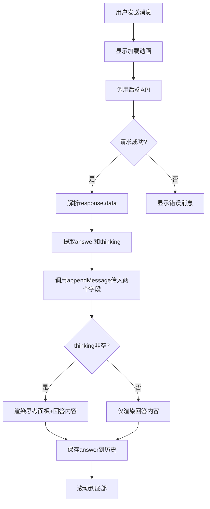
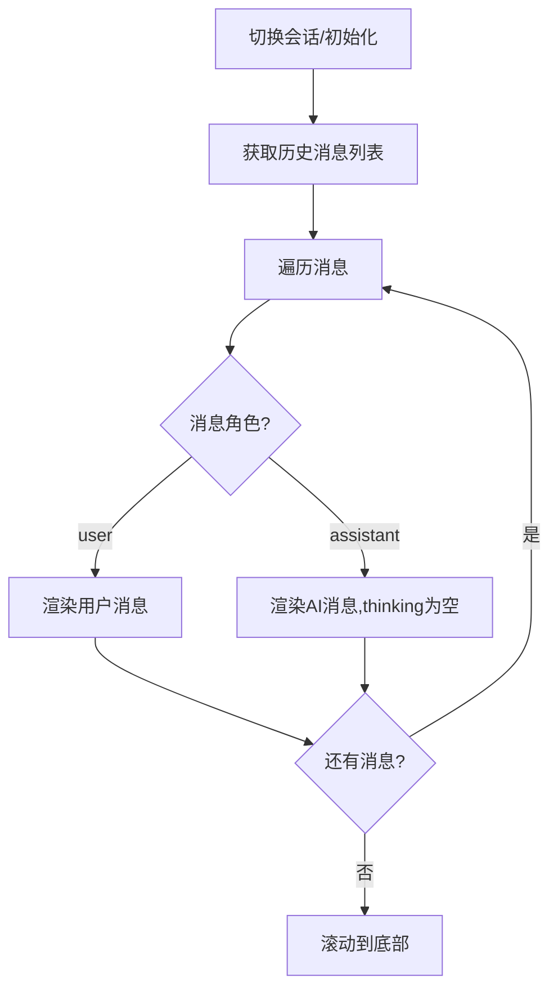

# 聊天组件更新 - 支持深度思考过程展示

## 需求概述

后端 `/chat` 接口返回结构已更新，从原来的简单字符串改为包含多个字段的 Map 结构。前端需要更新聊天组件以支持解析和展示新的数据结构，特别是展示 AI 的深度思考过程。

### 后端接口变更

**原数据结构：**

```
{
  "success": true,
  "data": "这是AI的回答内容..."
}
```

**新数据结构：**

```
{
  "success": true,
  "data": {
    "answer": "这是AI的回答内容...",
    "thinking": "这是思考过程..." // 可能为 null
  }
}
```

## 核心目标

1. 更新前端数据解析逻辑，正确处理新的 Map 结构
2. 在消息气泡中增加可折叠的思考过程展示区域
3. 保持与现有 UI 风格的一致性（Obsidian 风格）
4. 确保向后兼容性和良好的用户体验

## 功能设计

### 数据解析逻辑更新

#### 响应数据处理流程

消息发送成功后，需要更新响应处理逻辑：

1. 检查响应状态码和 `result.success` 字段
2. 提取 `result.data` 对象（不再是字符串）
3. 从 `data` 对象中分别提取 `answer` 和 `thinking` 字段
4. 将完整的数据结构传递给消息渲染方法

#### 数据结构定义

为了更好的类型安全，应当定义响应数据的接口结构：

| 字段名   | 类型           | 必需 | 说明                    |
| -------- | -------------- | ---- | ----------------------- |
| answer   | string         | 是   | AI 的最终回答内容       |
| thinking | string \| null | 否   | AI 的思考过程，可能为空 |

#### 会话历史存储策略

会话管理器需要决定如何存储这两部分内容：

**选项 A（推荐）：** 只存储 `answer` 到历史记录

-   理由：思考过程仅供用户当次查看，不需要作为上下文传递给后续对话
-   优势：减少存储空间，避免上下文污染
-   实施方式：在 `sessionManager.addMessage` 时仅传入 `answer` 字段

**选项 B：** 存储完整结构

-   理由：保留完整的对话记录供后续回溯
-   缺点：增加存储开销，可能影响性能

本设计采用 **选项 A**。

### UI 交互设计

#### 消息气泡结构

AI 消息气泡将采用以下层级结构（从上到下）：

```
[AI消息气泡容器]
  ├── [思考过程区域] (条件渲染，thinking非空时显示)
  │   ├── [折叠面板头部] (可点击)
  │   │   ├── [展开/收起图标]
  │   │   └── [标题文字: "思考过程"]
  │   └── [思考内容区域] (折叠时隐藏)
  │       └── [Markdown渲染的思考内容]
  │
  └── [回答内容区域]
      └── [Markdown渲染的回答内容]
```

#### 折叠面板交互规范

**初始状态：**

-   默认为收起状态（Collapsed）
-   仅显示标题栏："思考过程"
-   展开/收起图标指向右侧（▶）

**展开状态：**

-   标题栏保持可见
-   展开/收起图标指向下方（▼）
-   思考内容区域完整展示

**交互行为：**

-   点击标题栏任意位置触发展开/收起切换
-   添加平滑的展开/收起过渡动画（推荐 0.2-0.3 秒）
-   展开/收起状态不需要持久化（刷新后恢复默认收起）

#### 视觉样式设计

**思考过程区域整体：**

-   位置：消息气泡内容区域最顶部
-   与回答内容之间保持适当间距（推荐 8-12px）

**折叠面板头部：**

-   背景色：浅灰色 `var(--background-secondary)`
-   边框：1px 实线，颜色 `var(--background-modifier-border)`
-   圆角：4-6px
-   内边距：6-8px（上下） × 10-12px（左右）
-   字体大小：0.85em（比正文稍小）
-   字体颜色：`var(--text-muted)`
-   鼠标悬停：背景色略微加深，光标变为 pointer

**思考内容区域：**

-   背景色：`var(--background-primary-alt)`（更浅的灰色）
-   边框：1px 实线，颜色 `var(--background-modifier-border)`
-   圆角：底部 4-6px，顶部 0（与标题栏连接）
-   内边距：8-10px
-   字体大小：0.85em
-   字体颜色：`var(--text-muted)`
-   行高：1.4-1.5（保持紧凑）

**图标设计：**

-   使用 Obsidian 内置图标
    -   收起状态：`chevron-right` 或 `triangle-right`
    -   展开状态：`chevron-down` 或 `triangle-down`
-   图标大小：14-16px
-   颜色：继承文字颜色
-   图标与文字间距：6-8px

**Markdown 渲染处理：**

-   思考内容支持完整 Markdown 语法
-   代码块使用与主题一致的样式
-   列表、引用等元素保持紧凑间距
-   继承现有的 `.chat-message-bubble` 内 Markdown 紧凑样式

### 条件渲染逻辑

思考过程区域的渲染遵循以下规则：

| thinking 值   | 渲染行为 | 说明                        |
| ------------- | -------- | --------------------------- |
| null          | 不渲染   | 完全不创建思考过程 DOM 节点 |
| undefined     | 不渲染   | 完全不创建思考过程 DOM 节点 |
| "" (空字符串) | 不渲染   | 完全不创建思考过程 DOM 节点 |
| 非空字符串    | 渲染     | 创建完整的折叠面板结构      |

条件判断逻辑：`if (thinking && thinking.trim())`

## 技术实现方案

### 组件职责划分

#### ChatView 组件调整

**需要修改的方法：**

1. **sendMessage 方法（约 326-370 行）：**

    - 修改响应数据提取逻辑
    - 从 `result.data` 提取 `answer` 和 `thinking`
    - 将两个字段传递给 `appendMessage` 方法
    - 仅将 `answer` 保存到会话历史

2. **appendMessage 方法（约 516-534 行）：**

    - 增加可选参数 `thinking?: string | null`
    - 根据 `thinking` 参数决定是否渲染思考过程区域
    - 调用新增的渲染方法构建思考面板

3. **switchToSession 和 createNewSession 方法：**
    - 加载历史消息时，传递空的 `thinking` 参数
    - 确保历史消息不显示思考过程区域

**需要新增的方法：**

1. **renderThinkingPanel 方法：**
    - 接收参数：容器元素、思考内容文本
    - 创建折叠面板的 DOM 结构
    - 绑定展开/收起事件监听器
    - 渲染 Markdown 内容
    - 返回创建的面板元素

### 消息渲染流程

#### 发送新消息时



#### 加载历史消息时



### 样式实现策略

#### CSS 类命名规范

遵循 BEM 命名约定，新增以下 CSS 类：

| 类名                                 | 作用域 | 用途                       |
| ------------------------------------ | ------ | -------------------------- |
| thinking-panel                       | 块级   | 思考过程区域外层容器       |
| thinking-panel\_\_header             | 元素   | 折叠面板头部（可点击区域） |
| thinking-panel\_\_icon               | 元素   | 展开/收起图标容器          |
| thinking-panel\_\_title              | 元素   | 标题文字容器               |
| thinking-panel\_\_content            | 元素   | 思考内容区域               |
| thinking-panel\_\_content--collapsed | 修饰符 | 收起状态                   |
| thinking-panel\_\_content--expanded  | 修饰符 | 展开状态                   |

#### 响应式考虑

-   移动端适配：确保折叠面板在窄屏幕下正常显示
-   触摸友好：标题栏点击区域足够大（至少 44px 高度）
-   长文本处理：思考内容区域支持垂直滚动（如超过 300px 高度）

#### 动画实现

使用 CSS 过渡实现平滑展开/收起效果：

-   过渡属性：`max-height`, `opacity`, `padding`
-   过渡时长：0.3s
-   缓动函数：`ease-in-out`
-   收起状态：`max-height: 0; opacity: 0; padding: 0;`
-   展开状态：`max-height: 500px; opacity: 1; padding: 8-10px;`

### 数据处理细节

#### 空值处理矩阵

| 场景       | answer 值  | thinking 值 | 处理方式                     |
| ---------- | ---------- | ----------- | ---------------------------- |
| 正常响应   | 非空字符串 | 非空字符串  | 渲染完整消息（包含思考面板） |
| 无思考模式 | 非空字符串 | null        | 仅渲染回答内容               |
| 异常响应   | null/空    | 任意        | 显示错误消息，执行撤回       |
| 后端错误   | 任意       | 任意        | 显示错误提示，执行撤回       |

#### 向后兼容处理

为了确保代码能够兼容可能的旧版本后端响应，应当添加防御性检查：

1. 首先检查 `result.data` 是否为对象类型
2. 如果是字符串类型（旧格式），直接作为 `answer` 使用，`thinking` 为 null
3. 如果是对象类型，正常提取 `answer` 和 `thinking` 字段
4. 如果 `answer` 字段不存在，尝试回退到 `result.data` 本身

判断逻辑示例伪代码：

```
if data是字符串:
    answer = data
    thinking = null
else if data是对象:
    answer = data.answer 或 ""
    thinking = data.thinking 或 null
else:
    显示错误
```

### 错误处理

#### 异常情况处理

1. **数据格式错误：**

    - 现象：`result.data` 既不是字符串也不是预期的对象
    - 处理：显示友好错误提示"数据格式异常"，执行消息撤回

2. **Markdown 渲染失败：**

    - 现象：`MarkdownRenderer.render` 抛出异常
    - 处理：降级为纯文本显示，记录控制台错误日志

3. **DOM 操作失败：**
    - 现象：创建折叠面板时 DOM 节点不存在
    - 处理：跳过思考面板渲染，仅渲染回答内容

#### 日志记录

在以下关键节点添加调试日志：

-   响应数据提取成功：`console.log('Received answer and thinking')`
-   思考面板渲染开始：`console.debug('Rendering thinking panel')`
-   折叠面板状态切换：`console.debug('Thinking panel toggled')`
-   数据格式异常：`console.error('Invalid response data format')`

## 用户体验考虑

### 信息层次

1. **主要信息：** AI 的回答内容（answer）

    - 显著位置、正常字号、无需额外操作即可查看

2. **次要信息：** 思考过程（thinking）
    - 默认隐藏、较小字号、需要主动展开查看
    - 避免干扰主要内容的阅读

### 视觉权重

-   回答内容使用标准消息气泡样式，视觉焦点明确
-   思考过程使用淡灰色背景和较小字体，视觉权重降低
-   折叠状态下思考面板占用最小空间（仅一行标题）

### 交互反馈

-   鼠标悬停在折叠面板头部时，提供视觉反馈（背景色变化）
-   点击后立即响应，动画流畅自然
-   展开/收起图标方向清晰指示当前状态

### 性能优化

-   仅在 `thinking` 非空时创建相关 DOM 节点
-   避免不必要的重渲染
-   长思考内容设置最大高度并启用滚动，避免撑高页面
-   历史消息加载时跳过思考内容处理，减少计算开销

## 测试场景

### 功能测试

1. **正常流程：**

    - 开启深度思考模式
    - 发送消息并收到包含 thinking 的响应
    - 验证思考面板正确渲染且默认收起
    - 点击展开，验证内容正确显示
    - 点击收起，验证恢复到收起状态

2. **无思考内容：**

    - 关闭深度思考模式或后端返回 thinking 为 null
    - 验证不渲染思考面板
    - 验证回答内容正常显示

3. **思考内容为空字符串：**

    - 后端返回 thinking 为""
    - 验证不渲染思考面板

4. **Markdown 渲染：**

    - thinking 包含代码块、列表、引用等 Markdown 元素
    - 验证 Markdown 正确渲染且样式紧凑

5. **向后兼容：**
    - 模拟旧版本后端返回字符串 data
    - 验证能正确降级处理

### 样式测试

1. **主题适配：**

    - 在浅色主题下查看样式
    - 在深色主题下查看样式
    - 验证颜色变量正确应用

2. **响应式布局：**

    - 在不同窗口宽度下查看
    - 验证思考面板宽度自适应

3. **长文本处理：**
    - thinking 内容超过 300 字
    - 验证内容区域出现滚动条

### 交互测试

1. **多次切换：**

    - 连续多次点击折叠面板头部
    - 验证状态切换正常，无卡顿

2. **多条消息：**

    - 发送多条消息，部分有 thinking，部分没有
    - 验证每条消息独立渲染正确

3. **会话切换：**
    - 切换到其他会话
    - 验证历史消息不显示思考面板

### 边界条件测试

1. **极长 thinking：**

    - thinking 内容超过 10000 字
    - 验证渲染性能可接受，界面不卡顿

2. **特殊字符：**

    - thinking 包含 HTML 标签、特殊符号
    - 验证 Markdown 渲染安全，无 XSS 风险

3. **网络异常：**
    - 请求失败时验证撤回机制仍然正常
    - 验证不会遗留空的思考面板

## 实施优先级

### 第一阶段（核心功能）

1. 更新 `sendMessage` 方法的响应数据解析逻辑
2. 修改 `appendMessage` 方法签名，增加 `thinking` 参数
3. 实现 `renderThinkingPanel` 方法的基础 DOM 结构
4. 添加折叠/展开交互逻辑

### 第二阶段（样式优化）

1. 编写 CSS 样式，匹配设计规范
2. 实现展开/收起动画效果
3. 适配深色/浅色主题
4. 调整 Markdown 渲染样式

### 第三阶段（完善细节）

1. 添加向后兼容处理逻辑
2. 完善错误处理和日志记录
3. 优化性能（按需渲染）
4. 进行全面测试和调试

## 影响范围分析

### 修改的文件

| 文件路径    | 修改类型 | 影响范围                              |
| ----------- | -------- | ------------------------------------- |
| chatView.ts | 代码逻辑 | 中等 - 修改消息渲染相关方法           |
| styles.css  | 样式增加 | 小 - 新增思考面板样式，不影响现有样式 |

### 不修改的部分

-   sessionManager.ts：会话管理逻辑不变，仅存储 answer 字段
-   settings.ts：无需新增配置项
-   main.ts：插件初始化逻辑不变
-   其他 UI 组件：不受影响

### 数据兼容性

-   现有历史消息数据：完全兼容，不需要迁移
-   新消息数据：仅在前端展示时使用 thinking，不影响持久化格式
-   后端接口：如果后端回退到旧格式，前端能够降级处理

## 风险评估

### 技术风险

| 风险项                | 可能性 | 影响 | 缓解措施                                     |
| --------------------- | ------ | ---- | -------------------------------------------- |
| 后端数据格式不稳定    | 中     | 中   | 实施向后兼容逻辑，添加数据校验               |
| Markdown 渲染性能问题 | 低     | 低   | 限制思考内容最大高度，启用虚拟滚动（如需要） |
| 样式冲突              | 低     | 低   | 使用独立的 CSS 类名，遵循 BEM 规范           |
| 移动端适配问题        | 低     | 中   | 测试阶段充分验证移动端表现                   |

### 用户体验风险

| 风险项               | 可能性 | 影响 | 缓解措施                             |
| -------------------- | ------ | ---- | ------------------------------------ |
| 思考内容过长影响阅读 | 中     | 低   | 默认收起状态，最大高度限制           |
| 折叠面板操作不直观   | 低     | 中   | 使用明确的图标和标题，提供悬停反馈   |
| 与主题样式不协调     | 低     | 低   | 使用 Obsidian CSS 变量，测试多个主题 |

## 后续扩展可能性

1. **思考过程流式输出：**

    - 如果后端支持 SSE 流式传输 thinking 内容
    - 可以实现逐字显示的打字机效果

2. **思考过程语法高亮：**

    - 为思考过程中的推理步骤添加特殊标记
    - 例如用不同颜色区分"问题分析"、"知识检索"、"答案生成"阶段

3. **状态持久化：**

    - 记住用户对每条消息的展开/收起偏好
    - 下次打开时恢复状态

4. **导出功能：**

    - 支持将包含思考过程的对话导出为 Markdown 文件
    - 方便用户回顾和分享

5. **思考过程时间轴：**
    - 如果后端提供思考步骤的时间戳
    - 可视化展示思考过程的时间分布
