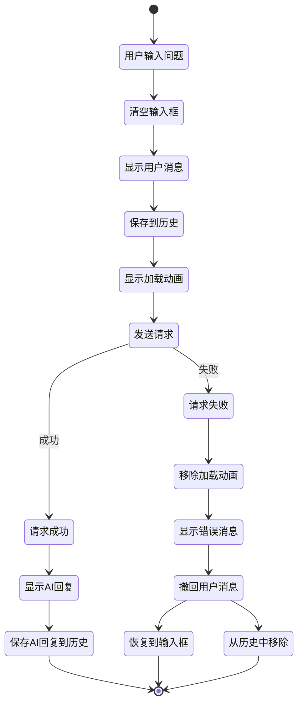
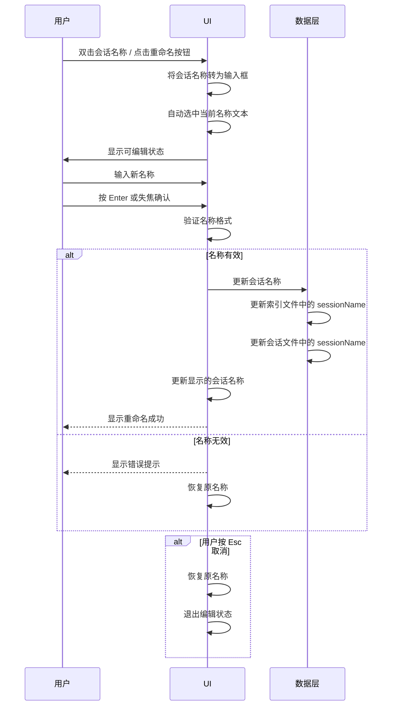
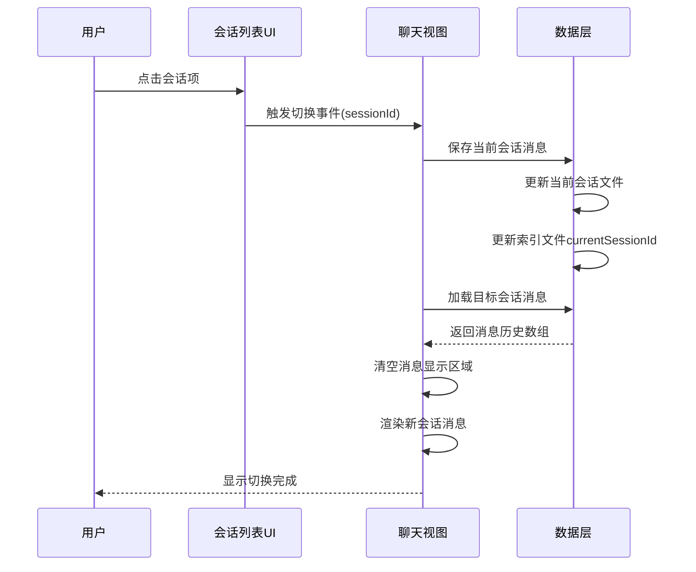
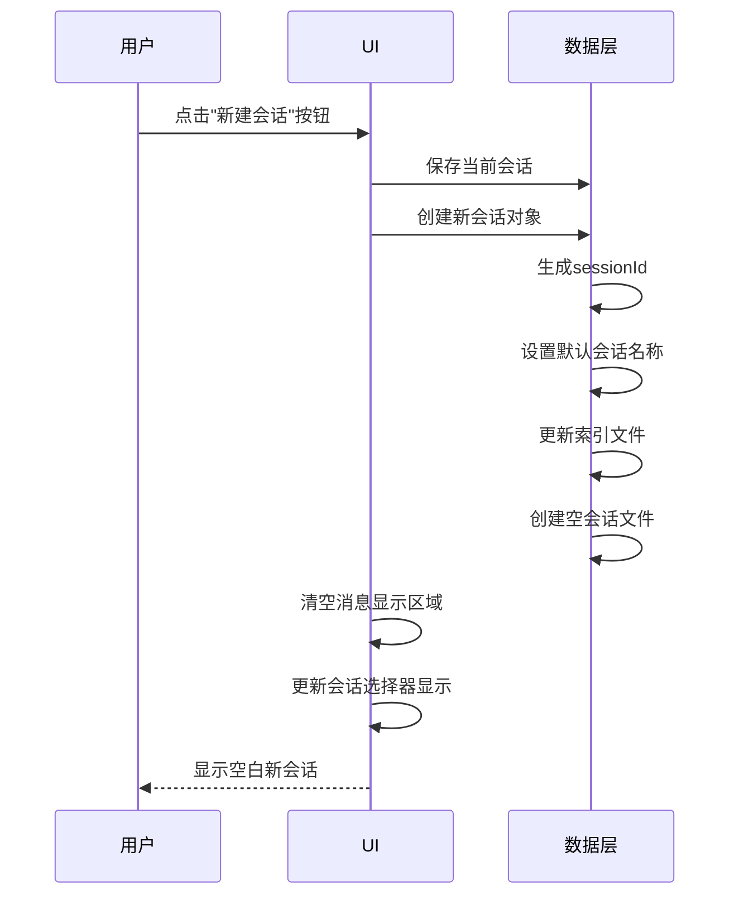
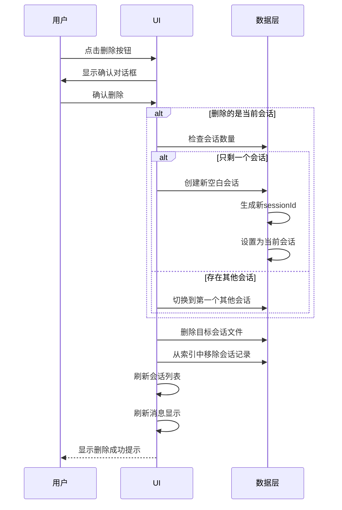
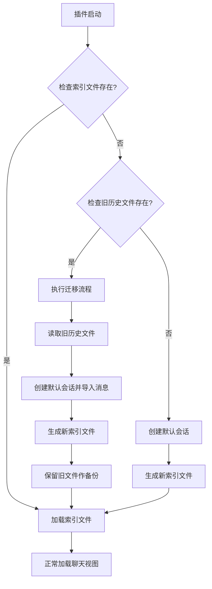

# 聊天失败处理与历史记录管理功能设计

## 一、设计概述

本设计旨在提升 RAG 助手聊天视图的用户体验，通过两个核心功能改进：

1. **智能失败恢复机制**：当聊天请求失败时，自动将用户输入恢复到输入框，避免用户重新输入
2. **多会话历史管理**：支持创建、切换、删除多个独立的聊天会话，便于用户组织不同主题的对话

### 设计目标

-   减少用户在网络故障或后端错误时的操作成本
-   提供清晰的多会话管理能力，支持并行进行多个主题的对话
-   保持现有功能的稳定性和用户体验一致性

---

## 二、功能需求分解

### 需求 1：聊天失败自动撤回机制

#### 业务场景

用户发送问题后，可能遇到以下失败情况：

-   前端无法连接到后端服务（网络故障、后端未启动）
-   后端返回错误响应（模型调用失败、配置错误）
-   请求超时或其他异常

#### 核心行为定义

| 失败类型 | 前端显示行为                 | 输入框行为           | 历史记录行为             |
| -------- | ---------------------------- | -------------------- | ------------------------ |
| 连接失败 | 显示错误消息气泡（红色标识） | 自动填充用户原始问题 | 移除已添加的用户消息记录 |
| 后端错误 | 显示后端返回的错误信息       | 自动填充用户原始问题 | 移除已添加的用户消息记录 |
| 请求超时 | 显示超时提示                 | 自动填充用户原始问题 | 移除已添加的用户消息记录 |

#### 状态流转



#### 交互细节

**失败恢复流程**

1. 捕获请求异常或错误响应
2. 移除界面上的 loading 动画元素
3. 在消息区域显示错误提示（带有明显的错误样式标识）
4. 从内存中的 `chatHistory` 数组中移除最后一条用户消息
5. 从界面上移除用户消息气泡
6. 将用户原始输入文本填充回输入框
7. 更新历史记录文件，同步移除失败的用户消息

**错误消息呈现**

-   使用专用的错误样式类（如 `chat-message-bubble error`）
-   错误消息显示在 AI 消息区域，使用红色边框或背景标识
-   错误消息格式：
    -   连接失败：`🔌 无法连接后端：[具体错误信息]`
    -   后端错误：`❌ [后端返回的错误消息]`
    -   超时：`⏱️ 请求超时，请检查网络连接`

---

### 需求 2：多会话历史记录管理

#### 业务场景

用户在使用 RAG 助手时，可能同时进行多个不同主题的对话：

-   关于项目 A 的技术咨询
-   关于文档 B 的内容总结
-   临时的快速问答

需要提供便捷的会话切换和管理能力，而不是所有对话混杂在同一个历史中。

#### 核心概念定义

**会话（Session）**

-   每个会话是一个独立的对话上下文
-   包含完整的消息历史记录
-   拥有唯一标识符和可读的会话名称

**会话数据结构**

| 字段名      | 类型   | 说明                                    |
| ----------- | ------ | --------------------------------------- |
| sessionId   | string | 唯一标识符（UUID 或时间戳生成）         |
| sessionName | string | 会话显示名称（默认：新会话 + 创建时间） |
| createdAt   | number | 创建时间戳                              |
| updatedAt   | number | 最后更新时间戳                          |
| messages    | Array  | 消息历史数组（格式同现有 chatHistory）  |

**历史记录文件结构调整**

现有设计：

-   单一文件 `Assets/History/chat_history.json`
-   存储格式：消息数组

新设计：

-   主索引文件：`Assets/History/sessions_index.json`
    -   存储所有会话的元数据列表
    -   记录当前激活的会话 ID
-   会话详情文件：`Assets/History/sessions/[sessionId].json`
    -   每个会话独立存储
    -   包含完整的消息历史

**主索引文件格式示例**

```
{
  "currentSessionId": "session_1733423456789",
  "sessions": [
    {
      "sessionId": "session_1733423456789",
      "sessionName": "新会话 12-05 23:10",
      "createdAt": 1733423456789,
      "updatedAt": 1733423567890,
      "messageCount": 8
    },
    {
      "sessionId": "session_1733420000123",
      "sessionName": "项目技术讨论",
      "createdAt": 1733420000123,
      "updatedAt": 1733422000456,
      "messageCount": 15
    }
  ]
}
```

**会话详情文件格式示例**

```
{
  "sessionId": "session_1733423456789",
  "sessionName": "新会话 12-05 23:10",
  "createdAt": 1733423456789,
  "updatedAt": 1733423567890,
  "messages": [
    { "role": "user", "content": "你好" },
    { "role": "assistant", "content": "你好！我是 RAG 助手..." }
  ]
}
```

#### UI 布局设计

**历史管理区域布局**（位于聊天视图顶部）

```
┌─────────────────────────────────────────────────┐
│  [≡ 会话列表]  新会话 12-05 23:10  [+ 新建] [🗑️]  │
├─────────────────────────────────────────────────┤
│  知识库助手                          [清空当前] │
├─────────────────────────────────────────────────┤
│                                                 │
│  [消息历史区域]                                  │
│                                                 │
└─────────────────────────────────────────────────┘
```

**会话列表下拉菜单内容**

```
┌─────────────────────────────────┐
│  ✓ 新会话 12-05 23:10  (8条)  [✏️] [🗑️] │
│    项目技术讨论  (15条)       [✏️] [🗑️] │
│    文档总结  (5条)            [✏️] [🗑️] │
│  ─────────────────────────      │
│    + 新建会话                    │
└─────────────────────────────────┘
```

每个会话条目显示：

-   激活状态标识（✓）
-   会话名称（支持重命名）
-   消息数量
-   重命名按钮（悬停显示，使用铅笔图标 pencil）
-   删除按钮（悬停显示，使用垃圾桶图标 trash）

#### 交互流程定义

**会话重命名流程**



**会话切换流程**



**新建会话流程**



**删除会话流程**



#### 功能边界定义

**会话命名**

-   自动生成默认名称（"新会话 + 创建时间"）
-   支持用户自定义重命名（双击会话名称或通过菜单操作）
-   会话名称长度限制：1-50 个字符
-   禁止使用特殊字符：`/ \ : * ? " < > |`（避免文件系统冲突）

**会话数量限制**

-   不设硬性上限
-   建议在 UI 显示时提供搜索/过滤功能（会话数量超过 10 个时）

**会话删除保护**

-   至少保留一个会话（删除最后一个时自动创建新会话）
-   删除前需要用户确认（弹窗提示）

**数据迁移**

-   首次加载时检测旧版历史文件 `chat_history.json`
-   如果存在，自动迁移到新格式（创建默认会话并导入消息）
-   迁移完成后保留原文件（不删除，防止数据丢失）

---

## 三、技术实现策略

### 数据层职责划分

**SessionManager（会话管理器）**

| 方法名              | 职责             | 输入              | 输出                               |
| ------------------- | ---------------- | ----------------- | ---------------------------------- |
| loadSessionsIndex   | 加载主索引文件   | 无                | SessionIndex 对象                  |
| saveSessionsIndex   | 保存主索引文件   | SessionIndex 对象 | void                               |
| loadSession         | 加载指定会话消息 | sessionId         | Session 对象                       |
| saveSession         | 保存会话消息     | Session 对象      | void                               |
| createSession       | 创建新会话       | 可选名称          | sessionId                          |
| deleteSession       | 删除会话         | sessionId         | boolean                            |
| switchSession       | 切换当前会话     | sessionId         | void                               |
| renameSession       | 重命名会话       | sessionId, 新名称 | boolean                            |
| validateSessionName | 验证会话名称     | 名称字符串        | { valid: boolean, error?: string } |
| getCurrentSession   | 获取当前会话     | 无                | Session 对象                       |
| migrateOldHistory   | 迁移旧版历史     | 无                | boolean                            |

**文件操作封装原则**

-   所有文件读写操作集中在 SessionManager 中
-   使用 Obsidian Vault API 进行文件操作
-   确保目录自动创建（`Assets/History/sessions/`）
-   异常处理：文件损坏时返回空数据结构，不中断用户操作

### UI 层职责划分

**ChatView 改造要点**

现有状态：

-   单一 `chatHistory` 数组
-   单一历史文件路径

改造后：

-   引入 `sessionManager` 实例
-   移除直接文件操作逻辑
-   通过 SessionManager 接口操作数据

**新增 UI 组件**

| 组件名称            | 位置                 | 功能                                                  |
| ------------------- | -------------------- | ----------------------------------------------------- |
| SessionSelector     | 聊天头部上方         | 会话选择下拉菜单 + 当前会话名称显示（支持双击重命名） |
| NewSessionButton    | SessionSelector 右侧 | 新建会话按钮                                          |
| DeleteSessionButton | SessionSelector 右侧 | 删除当前会话按钮                                      |
| SessionDropdownMenu | SessionSelector 展开 | 会话列表展示 + 切换交互                               |
| SessionRenameInput  | 会话名称处           | 内联编辑输入框（重命名时动态显示）                    |
| SessionItemActions  | 会话条目右侧         | 重命名和删除按钮组（悬停显示）                        |

### 失败恢复机制实现要点

**状态追踪**

在发送消息前记录必要状态：

| 状态变量名             | 类型        | 用途                     |
| ---------------------- | ----------- | ------------------------ |
| lastUserInput          | string      | 保存用户原始输入         |
| lastUserMessageElement | HTMLElement | 保存用户消息气泡元素引用 |
| isRequestPending       | boolean     | 标记是否有请求进行中     |

**撤回操作步骤**

1. 从 DOM 移除用户消息气泡（通过保存的元素引用）
2. 从 `chatHistory` 数组移除最后一条消息（调用 `pop()`）
3. 调用 `sessionManager.saveSession()` 同步文件
4. 将 `lastUserInput` 填充回输入框的 `value` 属性
5. 清空状态变量（`lastUserInput = null`）

**错误消息显示**

-   错误消息不加入 `chatHistory`（仅临时显示）
-   使用专用 CSS 类标识（`error-message`）
-   可选：提供"重试"按钮，点击后自动重新发送（使用输入框中的文本）

### 数据一致性保障

**保存时机**

| 操作场景     | 保存内容              | 保存时机                     |
| ------------ | --------------------- | ---------------------------- |
| 用户发送消息 | 当前会话消息          | 消息成功添加到历史后立即保存 |
| AI 回复成功  | 当前会话消息          | AI 消息添加到历史后立即保存  |
| 请求失败撤回 | 当前会话消息          | 移除失败消息后立即保存       |
| 切换会话     | 当前会话 + 索引       | 切换操作开始时先保存当前会话 |
| 新建会话     | 索引文件 + 新会话文件 | 创建操作完成时保存           |
| 删除会话     | 索引文件              | 删除操作完成时保存           |
| 清空历史     | 当前会话消息          | 清空操作完成时保存           |

**异常处理策略**

| 异常情况     | 处理方式                   |
| ------------ | -------------------------- |
| 索引文件损坏 | 创建新索引，生成默认会话   |
| 会话文件丢失 | 从索引移除该会话，提示用户 |
| 文件写入失败 | 显示错误提示，保留内存数据 |
| 目录创建失败 | 显示错误提示，禁用历史功能 |

---

## 四、用户体验优化

### 交互反馈设计

**会话名称验证规则**

| 验证项   | 规则                            | 错误提示                           |
| -------- | ------------------------------- | ---------------------------------- |
| 长度限制 | 1-50 字符                       | "会话名称长度应在 1-50 个字符之间" |
| 非空检查 | 不能为空或纯空格                | "会话名称不能为空"                 |
| 特殊字符 | 不能包含 `/ \ : * ? " < > \|`   | "会话名称不能包含特殊字符"         |
| 重复名称 | 允许重复（通过 sessionId 区分） | 无限制                             |

**操作确认提示**

| 操作               | 提示方式    | 提示内容                                     |
| ------------------ | ----------- | -------------------------------------------- |
| 切换会话           | 无需确认    | 直接切换（当前会话自动保存）                 |
| 新建会话           | 无需确认    | 直接创建                                     |
| 重命名会话（成功） | Notice 提示 | "会话已重命名"                               |
| 重命名会话（失败） | Notice 提示 | 显示具体验证错误信息                         |
| 删除会话           | 弹窗确认    | "确定删除会话「[名称]」吗？此操作不可撤销。" |
| 清空当前会话       | 弹窗确认    | "确定清空当前会话的所有消息吗？"             |
| 请求失败           | Notice 提示 | "消息发送失败，已恢复到输入框"               |

**加载状态呈现**

| 场景             | 加载指示                             |
| ---------------- | ------------------------------------ |
| 切换会话加载消息 | 消息区域显示 loading 动画，短暂遮罩  |
| 新建会话         | 立即清空显示，无需 loading（空会话） |
| 删除会话         | 无需 loading（操作瞬时完成）         |

### 视觉设计原则

**会话选择器样式**

-   当前会话名称显示：使用加粗字体，主题色文字，双击可编辑
-   重命名输入框：与原名称位置重叠，使用细边框，自动聚焦并选中文本
-   下拉菜单：与 Obsidian 原生下拉菜单风格保持一致
-   激活会话标识：使用主题色的对勾图标（✓）
-   操作按钮：重命名（pencil 图标）、删除（trash 图标），悬停时显示

**错误消息样式**

-   边框/背景：使用红色色调（参考 Obsidian 的错误提示色）
-   图标：使用警告图标（如 ⚠️ 或 Obsidian 的 alert-triangle 图标）
-   文字颜色：深红色，确保可读性

**按钮布局**

-   新建会话按钮：使用加号图标（plus）
-   重命名会话按钮：使用铅笔图标（pencil）
-   删除会话按钮：使用垃圾桶图标（trash）
-   所有按钮统一使用 Obsidian 的 `setIcon` API 设置图标
-   操作按钮使用 tooltip 提示功能（通过 `aria-label` 属性）

---

## 五、兼容性与迁移

### 数据向后兼容

**首次运行检测流程**



**迁移规则**

-   旧文件路径：`Assets/History/chat_history.json`
-   迁移后会话名称：`历史会话 [迁移日期]`
-   迁移后会话 ID：`migrated_[timestamp]`
-   旧文件处理：重命名为 `chat_history.json.backup`（保留备份）

### 功能降级策略

如果会话管理功能初始化失败（如文件系统权限问题）：

1. 回退到内存模式：仅在内存中维护单一会话
2. 禁用会话切换 UI（隐藏会话选择器）
3. 显示警告提示："历史记录功能不可用，消息仅保存在内存中"
4. 保持基本聊天功能可用

---

## 六、实现优先级建议

### 第一阶段（核心功能）

1. **失败撤回机制**

    - 实现状态追踪和撤回逻辑
    - 添加错误消息样式
    - 完成基本的失败恢复流程

2. **SessionManager 基础实现**

    - 实现文件读写方法
    - 实现会话创建、加载、保存
    - 实现会话重命名和名称验证
    - 完成数据迁移逻辑

3. **会话切换 UI**
    - 添加会话选择器
    - 实现会话列表显示
    - 实现切换交互

### 第二阶段（完善功能）

4. **会话管理操作**

    - 实现新建会话功能
    - 实现重命名会话功能（双击编辑 + 按钮触发）
    - 实现删除会话功能
    - 添加确认对话框和输入验证

5. **UI 优化**
    - 完善样式和布局
    - 实现内联编辑交互
    - 添加加载状态指示
    - 优化交互反馈

### 第三阶段（增强功能）

6. **高级特性**（可选）
    - 会话搜索/过滤
    - 导出会话记录
    - 会话统计信息（消息数量、创建时间等）
    - 会话标签/分类系统

---

## 七、测试场景清单

### 失败撤回功能测试

| 测试场景                   | 预期结果                           |
| -------------------------- | ---------------------------------- |
| 后端服务未启动时发送消息   | 显示连接错误，消息恢复到输入框     |
| 后端返回 500 错误          | 显示错误信息，消息恢复到输入框     |
| 网络请求超时               | 显示超时提示，消息恢复到输入框     |
| 连续两次失败               | 两次都能正确恢复，不会出现数据混乱 |
| 失败后手动修改输入框再发送 | 以新内容发送，不影响历史记录       |

### 会话重命名功能测试

| 测试场景                   | 预期结果                                |
| -------------------------- | --------------------------------------- |
| 双击会话名称               | 进入编辑状态，文本自动选中              |
| 点击重命名按钮             | 进入编辑状态，文本自动选中              |
| 输入有效名称并按 Enter     | 保存成功，显示新名称                    |
| 输入空名称                 | 显示错误提示，保持原名称                |
| 输入超长名称（>50 字符）   | 显示错误提示，保持原名称                |
| 输入包含特殊字符的名称     | 显示错误提示，保持原名称                |
| 编辑时按 Esc 键            | 取消编辑，恢复原名称                    |
| 编辑时失焦（点击其他区域） | 保存有效输入 / 恢复原名称（如输入无效） |
| 重命名当前激活的会话       | 顶部显示名称同步更新                    |
| 重命名非当前会话           | 列表中名称更新，不影响当前会话显示      |
| 连续重命名多次             | 每次都能正确保存到文件                  |

### 会话管理功能测试

| 测试场景                        | 预期结果                          |
| ------------------------------- | --------------------------------- |
| 首次启动（无历史）              | 自动创建默认会话                  |
| 首次启动（有旧历史）            | 自动迁移到新格式，旧文件保留      |
| 创建新会话                      | 生成唯一 ID，保存到索引，切换成功 |
| 切换会话（有消息）              | 当前会话保存，新会话消息正确加载  |
| 切换会话（空会话）              | 显示空白消息区域                  |
| 删除当前会话（仅剩一个）        | 自动创建新会话并切换              |
| 删除当前会话（存在其他会话）    | 切换到第一个其他会话              |
| 删除非当前会话                  | 索引更新，当前会话不变            |
| 在会话 A 发送消息后切换到会话 B | 两个会话的消息互不干扰            |

### 边界条件测试

| 测试场景                   | 预期结果                           |
| -------------------------- | ---------------------------------- |
| 会话文件被外部删除         | 从索引移除，不影响其他会话         |
| 索引文件损坏               | 重新创建索引，已有会话文件尝试恢复 |
| 消息数量超过 1000 条       | 正常加载和显示（性能测试）         |
| 快速连续切换会话           | 数据保存不丢失，UI 响应正常        |
| 同时打开多个 Obsidian 窗口 | 文件操作不冲突（Vault API 保障）   |

---

## 八、风险评估与应对

### 潜在风险

| 风险项                    | 影响程度 | 应对策略                                 |
| ------------------------- | -------- | ---------------------------------------- |
| 数据迁移失败导致历史丢失  | 高       | 保留旧文件备份，提供手动恢复指引         |
| 会话文件过多影响性能      | 中       | 建议用户定期清理，未来考虑归档功能       |
| 文件并发写入冲突          | 低       | 依赖 Obsidian Vault API 的文件锁机制     |
| UI 布局在小屏幕设备上错位 | 中       | 使用响应式布局，测试移动端适配           |
| 失败撤回时输入框已被修改  | 低       | 撤回前检查输入框是否为空，非空则提示用户 |

### 回滚方案

如果新功能出现严重问题：

1. 通过设置开关禁用会话管理功能
2. 回退到使用旧版单一历史文件模式
3. 提供数据导出工具，避免用户数据丢失

---

## 九、后续扩展方向

### 可扩展特性

1. **会话分享/导出**

    - 导出会话为 Markdown 文件
    - 支持导入他人分享的会话

2. **会话搜索**

    - 全局搜索所有会话中的消息内容
    - 支持按关键词跳转到特定消息

3. **会话模板**

    - 预设常用对话模板（如"代码审查"、"文档总结"）
    - 新建会话时可选择模板

4. **会话统计**

    - 显示会话的消息数量、字数统计
    - 显示 AI 响应时间统计

5. **会话标签/分类**

    - 为会话添加标签（如"工作"、"学习"）
    - 支持按标签筛选会话

6. **智能会话归档**
    - 超过一定时间未使用的会话自动归档
    - 归档会话不在主列表显示，但可搜索

---

## 十、设计原则总结

### 用户体验优先

-   失败不丢失用户输入，减少重复劳动
-   会话切换流畅，操作直观
-   错误提示清晰，反馈及时

### 数据安全第一

-   所有操作前先保存当前状态
-   关键操作（删除）需要确认
-   保留数据备份，支持恢复

### 渐进式增强

-   核心功能优先实现
-   高级特性逐步迭代
-   保持向后兼容

### 技术架构清晰

-   数据层和 UI 层职责分离
-   文件操作集中管理
-   错误处理完备

---

## 附录：关键 API 参考

### Obsidian Vault API 使用

| API 方法                            | 用途                    |
| ----------------------------------- | ----------------------- |
| `vault.getAbstractFileByPath(path)` | 检查文件/文件夹是否存在 |
| `vault.read(file)`                  | 读取文件内容            |
| `vault.modify(file, data)`          | 修改已存在文件          |
| `vault.create(path, data)`          | 创建新文件              |
| `vault.delete(file)`                | 删除文件                |
| `vault.createFolder(path)`          | 创建文件夹              |

### 数据格式示例

**会话索引文件完整示例**

```
{
  "version": "1.0",
  "currentSessionId": "session_1733423456789",
  "sessions": [
    {
      "sessionId": "session_1733423456789",
      "sessionName": "新会话 12-05 23:10",
      "createdAt": 1733423456789,
      "updatedAt": 1733423567890,
      "messageCount": 8
    }
  ]
}
```

**会话详情文件完整示例**

```
{
  "sessionId": "session_1733423456789",
  "sessionName": "新会话 12-05 23:10",
  "createdAt": 1733423456789,
  "updatedAt": 1733423567890,
  "messages": [
    {
      "role": "user",
      "content": "什么是 RAG？"
    },
    {
      "role": "assistant",
      "content": "RAG (Retrieval-Augmented Generation) 是一种结合检索和生成的 AI 技术..."
    }
  ]
}
```
