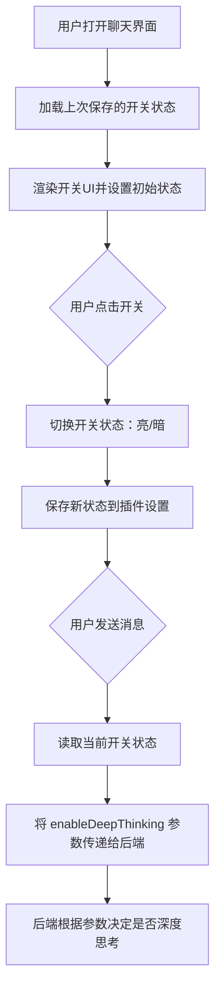
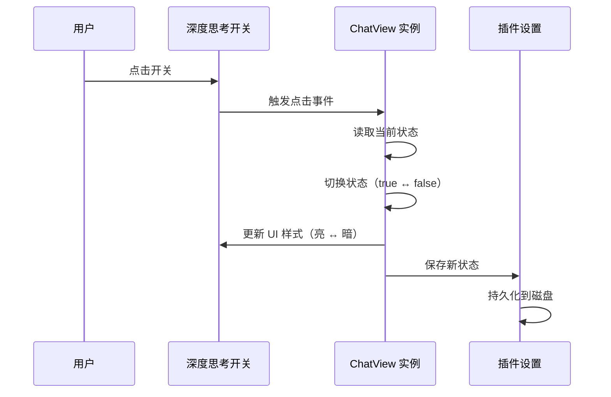

# ChatView 深度思考开关功能设计

## 功能概述

在 ChatView 聊天界面的输入框区域添加一个切换开关，用于控制大模型是否启用深度思考模式。开关状态会持久化保存，并在发送消息时传递给后端。

## 需求分析

### 核心需求

-   在聊天输入框附近添加深度思考切换开关
-   开关采用可视化状态：点亮表示开启，变暗表示关闭
-   用户设置的开关状态需要持久化，下次使用时自动恢复
-   发送消息时将开关状态作为参数 `enableDeepThinking` 传递给后端

### 用户交互流程



## 设计方案

### 数据模型变更

#### 插件设置扩展

在 `settings.ts` 的 `RagSettings` 接口中新增字段：

| 字段名             | 类型    | 默认值 | 说明                 |
| ------------------ | ------- | ------ | -------------------- |
| enableDeepThinking | boolean | false  | 是否启用深度思考模式 |

#### 对话历史扩展

现有的 `chatHistory` 数组不需要存储开关状态，因为该状态属于用户偏好设置，与具体对话内容无关。

### UI 组件设计

#### 开关位置布局

开关位置在输入框区域，具体布局结构：

```
chat-input-area (容器)
├── deep-thinking-toggle-container (新增：开关容器)
│   ├── toggle-icon (图标：脑图标或灯泡图标)
│   ├── toggle-switch (切换开关元素)
│   └── toggle-label (文字标签："深度思考")
└── input-box-container (原有：输入框容器)
    ├── textarea (输入框)
    └── send-btn (发送按钮)
```

#### 开关样式状态

| 状态       | 视觉表现               | CSS 类                          |
| ---------- | ---------------------- | ------------------------------- |
| 开启（亮） | 高亮颜色、图标发光效果 | `deep-thinking-toggle active`   |
| 关闭（暗） | 灰色或低透明度         | `deep-thinking-toggle inactive` |
| 悬停       | 轻微高亮提示可点击     | `deep-thinking-toggle:hover`    |

#### 图标选择建议

可使用 Obsidian 内置图标：

-   `zap`（闪电图标）- 表示增强模式

### 功能流程设计

#### 初始化流程

1. ChatView 的 `onOpen` 方法中，在创建输入区域时添加开关组件
2. 从 `plugin.settings.enableDeepThinking` 读取上次保存的状态
3. 根据读取的状态设置开关的初始外观（亮/暗）

#### 状态切换流程



#### 消息发送流程

在现有的 `sendMessage` 函数中扩展请求体：

**现有请求体结构**：

```
{
  question: string,
  provider: string,
  model: string,
  history: array
}
```

**扩展后请求体结构**：

```
{
  question: string,
  provider: string,
  model: string,
  history: array,
  enableDeepThinking: boolean  // 新增字段
}
```

发送逻辑：

1. 用户点击发送按钮或按下 Enter 键
2. `sendMessage` 函数读取 `this.plugin.settings.enableDeepThinking` 的当前值
3. 将该值作为 `enableDeepThinking` 参数添加到请求体中
4. 发送 POST 请求到后端
5. 后端根据 `enableDeepThinking` 参数决定是否启用深度思考模式

### 状态持久化策略

#### 保存时机

-   用户每次点击开关切换状态时立即保存
-   调用 `plugin.saveSettings()` 方法将设置写入磁盘

#### 加载时机

-   ChatView 的 `onOpen` 方法中初始化开关时加载
-   从 `plugin.settings` 对象直接读取

#### 数据存储位置

利用 Obsidian 插件的设置持久化机制，数据保存在：

```
<Vault>/.obsidian/plugins/<plugin-id>/data.json
```

## 实现要点

### ChatView 组件修改

#### 1. 添加开关 DOM 结构

在 `onOpen` 方法的输入区域创建逻辑中：

-   在 `chat-input-area` 容器内，`input-box-container` 之前插入开关容器
-   创建包含图标、开关元素、标签的完整结构

#### 2. 绑定状态切换事件

为开关元素添加点击事件监听器：

-   读取当前的 `plugin.settings.enableDeepThinking` 值
-   切换布尔值（true ↔ false）
-   更新开关的 CSS 类以改变视觉状态
-   调用 `plugin.saveSettings()` 保存新状态

#### 3. 修改发送消息逻辑

在 `sendMessage` 函数的 fetch 请求中：

-   在构建请求体时，添加 `enableDeepThinking: this.plugin.settings.enableDeepThinking`
-   确保该字段与其他参数一起发送给后端

### 设置模块修改

#### settings.ts

在 `RagSettings` 接口中添加：

```
enableDeepThinking: boolean;
```

在 `DEFAULT_SETTINGS` 对象中添加默认值：

```
enableDeepThinking: false
```

### 样式设计

#### CSS 类定义

需要在 `styles.css` 中定义以下样式：

| 类名                              | 用途                 |
| --------------------------------- | -------------------- |
| `.deep-thinking-toggle-container` | 开关容器布局         |
| `.deep-thinking-toggle`           | 开关基础样式         |
| `.deep-thinking-toggle.active`    | 开启状态样式（高亮） |
| `.deep-thinking-toggle.inactive`  | 关闭状态样式（变暗） |
| `.deep-thinking-toggle:hover`     | 悬停交互效果         |
| `.toggle-label`                   | 文字标签样式         |

#### 视觉效果建议

**开启状态（亮）**：

-   图标颜色：主题色或亮色（如蓝色、金色）
-   背景色：轻微高亮或透明
-   文字颜色：正常可读色
-   可选：添加发光效果（box-shadow 或 filter）

**关闭状态（暗）**：

-   图标颜色：灰色
-   背景色：透明或极浅色
-   文字颜色：灰色或低对比度色
-   透明度：0.5 - 0.7

**过渡动画**：

-   状态切换时添加平滑过渡效果（transition: all 0.3s ease）

## 后端接口契约

### 请求参数扩展

后端的 `/api/rag/chat` 接口需要接收新增参数：

| 参数名             | 类型    | 必填 | 说明                 |
| ------------------ | ------- | ---- | -------------------- |
| enableDeepThinking | boolean | 是   | 是否启用深度思考模式 |

### 预期后端行为

-   当 `enableDeepThinking = true` 时，后端应启用更深入的推理、分析或检索策略
-   当 `enableDeepThinking = false` 时，后端使用标准响应模式
-   后端应能正常处理该参数，即使旧版本不支持也应向后兼容

## 异常处理

### 设置加载失败

-   如果 `plugin.settings.enableDeepThinking` 未定义，使用默认值 `false`
-   确保代码中有兜底逻辑防止 undefined 错误

### 状态保存失败

-   即使保存失败，开关的内存状态仍然生效，不影响当前会话
-   可在控制台输出警告信息，但不干扰用户操作

### UI 渲染异常

-   如果图标加载失败，至少保留文字标签和切换功能
-   确保即使样式未加载，开关仍可点击使用

## 用户体验优化

### 状态反馈

-   点击开关后立即更新视觉状态，无需等待保存完成
-   可选：添加轻微的动画效果（如淡入淡出、缩放）

### 提示信息

-   可选：首次使用时显示简短提示说明深度思考功能
-   可选：鼠标悬停时显示 tooltip 说明当前状态

### 一致性

-   开关的开启/关闭状态应在整个会话中保持一致
-   用户刷新页面或重启 Obsidian 后状态应正确恢复

## 测试要点

### 功能测试

1. 开关初始状态是否正确（首次使用应为关闭）
2. 点击开关后状态是否正确切换
3. 状态切换后视觉效果是否正确（亮/暗）
4. 关闭并重新打开 ChatView，状态是否正确恢复
5. 发送消息时 `enableDeepThinking` 参数是否正确传递

### 持久化测试

1. 切换状态后，重启 Obsidian，状态是否保持
2. 多次快速切换，最终保存的状态是否正确
3. 在不同对话会话中，状态是否一致

### 边界测试

1. 插件首次安装时，默认状态是否为 false
2. 设置文件损坏或缺失时，是否能正常使用默认值
3. 后端不支持该参数时，前端是否仍能正常发送请求

### UI 测试

1. 不同主题下开关的可见性和对比度
2. 窗口缩放时开关位置是否合理
3. 移动端（如果支持）开关是否可用且易于点击

## 扩展性考虑

### 未来可能的扩展方向

1. **多级思考模式**

    - 将布尔开关扩展为多级选择（如：快速、标准、深度）
    - 使用下拉菜单或分段控件替代开关

2. **模式预设**

    - 为不同场景预设不同的思考模式
    - 允许用户自定义和保存预设

3. **统计与反馈**

    - 记录深度思考模式的使用频率
    - 对比不同模式下的响应质量和耗时

4. **快捷键支持**
    - 允许用户通过快捷键快速切换深度思考模式
    - 在命令面板中添加切换命令

### 兼容性保障

-   新增的设置字段应有明确的默认值
-   后端接口应向后兼容，即使不支持新参数也不应报错
-   前端代码应优雅降级，即使开关组件创建失败也不影响基本聊天功能
