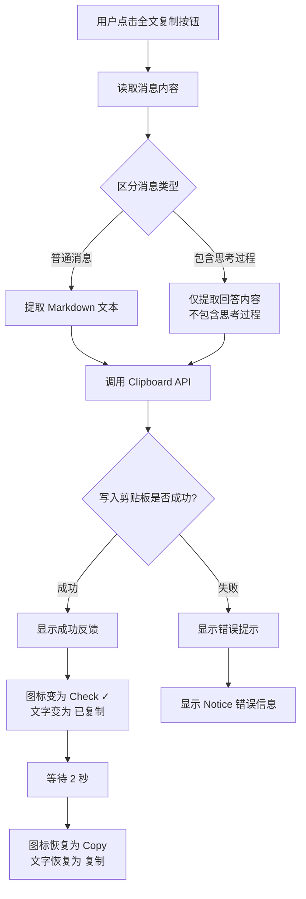
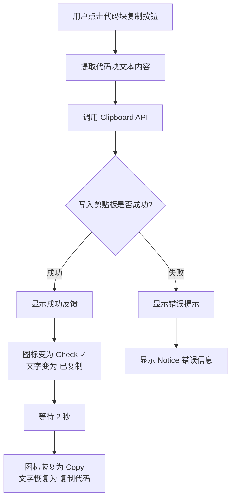
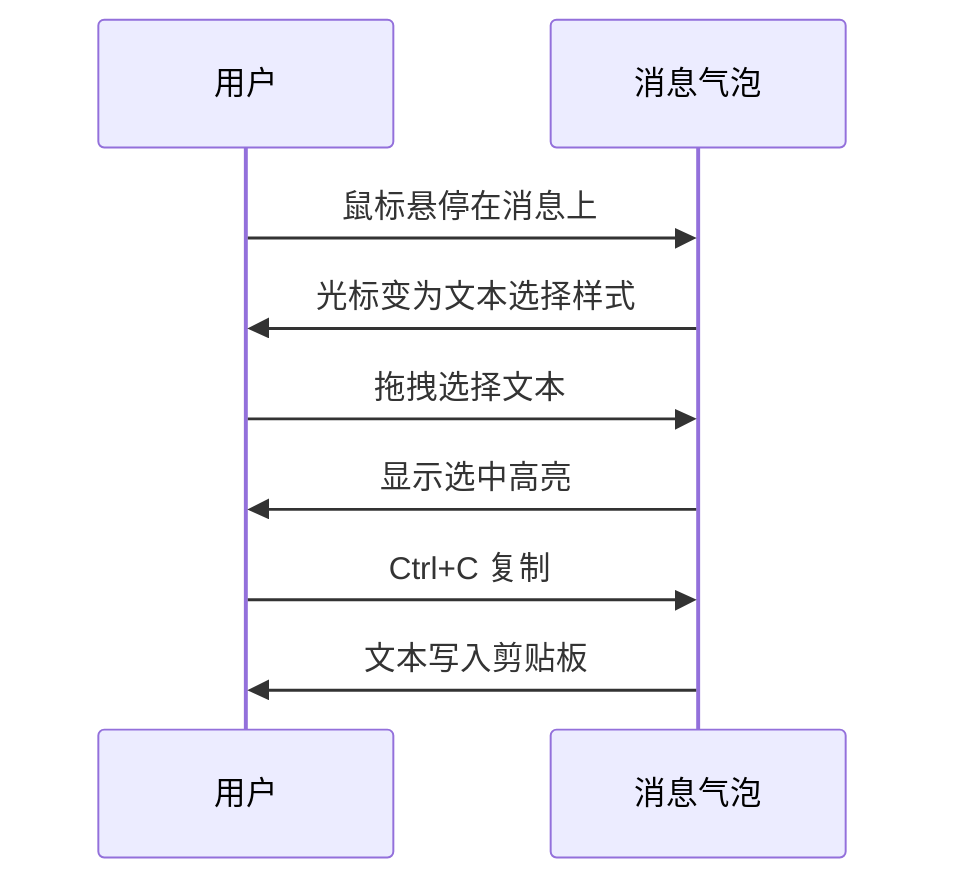
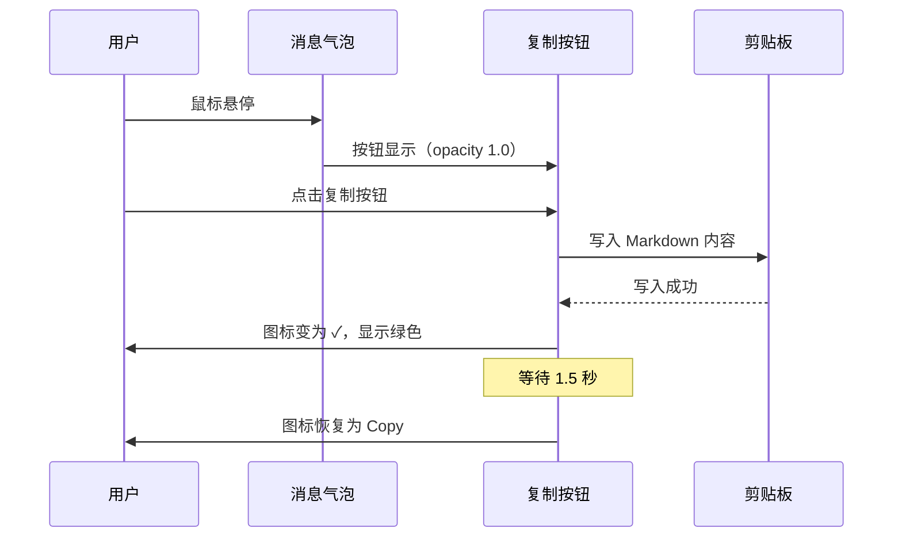
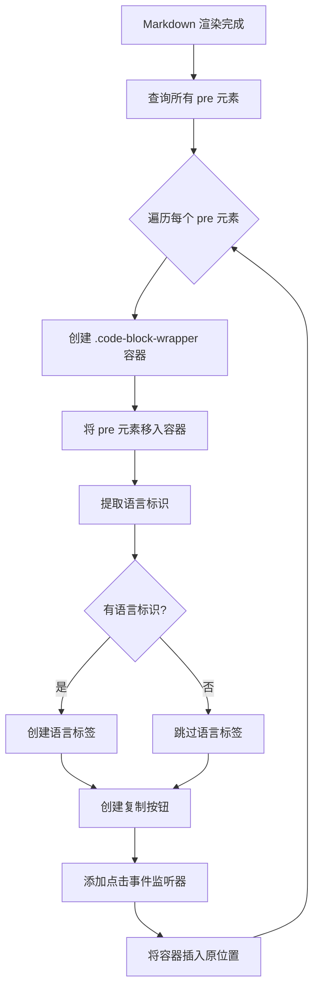

# 功能设计：修复文本选择与添加复制按钮

## 1. 功能概述

本设计旨在优化聊天界面的用户体验，包含两个核心改进点：

-   修复消息内容区域的文本选择功能
-   为 AI 回复消息添加一键复制按钮

## 2. 设计目标

### 2.1 文本选择修复

**目标**：用户能够正常选择和复制消息气泡中的文本内容

**现状分析**：

-   当前消息气泡可能因 CSS 样式限制导致文本无法选择
-   需要确保 `user-select` 属性设置正确

### 2.2 复制按钮功能

**目标**：为每条 AI 回复提供快捷复制能力

**价值**：

-   提升用户体验，减少手动选择复制的操作成本
-   符合现代聊天应用的交互习惯

## 3. 功能设计

### 3.1 文本选择修复

#### 3.1.1 应用范围

-   目标元素：`.chat-message-bubble` 消息气泡容器
-   适用消息类型：用户消息（user）和 AI 消息（ai）

#### 3.1.2 样式调整策略

| CSS 属性      | 预期值                | 说明             |
| ------------- | --------------------- | ---------------- |
| `user-select` | `text`                | 允许用户选择文本 |
| `cursor`      | `text` (悬停在文本时) | 提供视觉反馈     |

#### 3.1.3 边界情况处理

-   加载状态的消息气泡（`.loading`）不需要可选择
-   错误消息（`.error`）应保持可选择，便于复制错误信息

---

### 3.2 一键复制按钮

#### 3.2.1 显示位置与时机

**位置策略**：

-   全文复制按钮：渲染于每条 AI 消息气泡（`.chat-message-bubble.ai`）的**左下角**
-   代码块复制按钮：渲染于每个代码块（`<pre>` 标签）的**右上角**
-   通过绝对定位实现，不影响消息内容布局

**显示时机**：

-   默认状态：半透明（opacity 约 0.3-0.4）
-   悬停状态：鼠标悬停在消息气泡/代码块上时，按钮变为完全不透明（opacity 1.0）
-   过渡动画：使用 `transition` 实现平滑渐变效果（约 0.2 秒）

#### 3.2.2 视觉设计

**全文复制按钮设计**：

| 元素         | 设计规格                                                                                     |
| ------------ | -------------------------------------------------------------------------------------------- |
| **图标**     | Lucide Icons 的 `copy` 图标（未点击）/ `check` 图标（已复制）                                |
| **文本标签** | "复制" / "已复制"                                                                            |
| **布局**     | 图标在左，文字在右，横向排列                                                                 |
| **尺寸**     | 图标 14x14 px，整体按钮高度约 28-32px                                                        |
| **颜色**     | 默认：`var(--text-muted)`<br>悬停：`var(--text-normal)`<br>成功：`var(--interactive-accent)` |
| **背景**     | `var(--background-secondary)` 带轻微圆角                                                     |
| **圆角**     | 6px                                                                                          |
| **边距**     | 距离气泡左下角约 8-10px                                                                      |
| **内边距**   | 左右 10px，上下 6px                                                                          |
| **间距**     | 图标与文字间距 6px                                                                           |

**代码块复制按钮设计**：

| 元素         | 设计规格                                                                                     |
| ------------ | -------------------------------------------------------------------------------------------- |
| **图标**     | Lucide Icons 的 `copy` 图标（未点击）/ `check` 图标（已复制）                                |
| **文本标签** | "复制代码" / "已复制"                                                                        |
| **布局**     | 图标在左，文字在右，横向排列                                                                 |
| **尺寸**     | 图标 14x14 px，整体按钮高度约 28-32px                                                        |
| **颜色**     | 默认：`var(--text-muted)`<br>悬停：`var(--text-normal)`<br>成功：`var(--interactive-accent)` |
| **背景**     | `var(--code-background)` 或 `var(--background-secondary)`                                    |
| **圆角**     | 4px                                                                                          |
| **位置**     | 代码块右上角，距离边缘 8px                                                                   |
| **内边距**   | 左右 10px，上下 6px                                                                          |
| **间距**     | 图标与文字间距 6px                                                                           |

#### 3.2.3 交互逻辑流程

**全文复制按钮交互流程**：



**代码块复制按钮交互流程**：



#### 3.2.4 数据复制策略

**全文复制内容来源**：

-   优先级 1：从 `appendMessage` 方法传入的原始 `text` 参数（Markdown 格式）
-   优先级 2：如果无法获取原始文本，则从 DOM 中提取纯文本（降级方案）

**代码块复制内容来源**：

-   从 `<pre><code>` 标签中提取纯文本内容
-   使用 `textContent` 或 `innerText` 获取代码文本
-   保留代码的原始格式（换行、缩进等）

**数据结构要求**：

-   需要在消息气泡 DOM 元素上附加数据属性，存储原始 Markdown 内容
-   建议使用 `data-message-content` 属性存储全文内容
-   代码块无需额外数据属性，直接从 DOM 提取

**思考过程排除**：

-   当消息包含思考过程（`thinking` 参数）时，全文复制按钮仅复制回答内容（`answer`）
-   不将思考面板（`.thinking-panel`）的内容包含在复制范围内

##### 3.2.5 视觉反馈机制

**成功状态（全文复制按钮）**：

1. 图标从 `copy` 切换为 `check`（✓）
2. 文字从 "复制" 变为 "已复制"
3. 颜色变为成功色（如 `var(--interactive-accent)`）
4. 持续时间：2 秒
5. 自动恢复为初始状态（图标和文字同步恢复）

**成功状态（代码块复制按钮）**：

1. 图标从 `copy` 切换为 `check`（✓）
2. 文字从 "复制代码" 变为 "已复制"
3. 颜色变为成功色（如 `var(--interactive-accent)`）
4. 持续时间：2 秒
5. 自动恢复为初始状态（图标和文字同步恢复）

**失败状态**：

-   使用 Obsidian 的 `Notice` API 显示错误提示
-   提示文本示例："复制失败，请重试"
-   按钮状态不变，用户可重新点击

#### 3.2.6 样式设计细节

**全文复制按钮容器样式**：
| 属性 | 值 | 说明 |
|-----|-----|------|
| `position` | `absolute` | 绝对定位 |
| `bottom` | `8px` | 距离气泡底部 |
| `left` | `8px` | 距离气泡左侧 |
| `padding` | `6px 10px` | 上下 6px，左右 10px |
| `border-radius` | `6px` | 圆角 |
| `cursor` | `pointer` | 指针样式 |
| `opacity` | `0.4`（默认）<br>`1.0`（悬停） | 透明度 |
| `transition` | `all 0.2s ease` | 过渡动画 |
| `background-color` | `var(--background-secondary)` | 背景色 |
| `display` | `flex` | 弹性布局 |
| `align-items` | `center` | 垂直居中 |
| `gap` | `6px` | 图标与文字间距 |
| `font-size` | `0.85em` | 文字大小 |

**代码块复制按钮容器样式**：
| 属性 | 值 | 说明 |
|-----|-----|------|
| `position` | `absolute` | 绝对定位 |
| `top` | `8px` | 距离代码块顶部 |
| `right` | `8px` | 距离代码块右侧 |
| `padding` | `6px 10px` | 上下 6px，左右 10px |
| `border-radius` | `4px` | 圆角 |
| `cursor` | `pointer` | 指针样式 |
| `opacity` | `0.5`（默认）<br>`1.0`（悬停） | 透明度 |
| `transition` | `all 0.2s ease` | 过渡动画 |
| `background-color` | `var(--background-secondary)` | 背景色 |
| `display` | `flex` | 弹性布局 |
| `align-items` | `center` | 垂直居中 |
| `gap` | `6px` | 图标与文字间距 |
| `font-size` | `0.8em` | 文字大小 |
| `z-index` | `10` | 层级，确保在代码上方 |

**悬停触发区域**：

-   全文复制按钮：鼠标悬停在 `.chat-message-bubble.ai` 上时高亮显示
-   代码块复制按钮：鼠标悬停在代码块容器（`.code-block-wrapper`）上时高亮显示
-   使用 CSS 伪类实现（如 `.chat-message-bubble.ai:hover .copy-full-btn`）

---

### 3.3 DOM 结构设计

#### 3.3.1 消息气泡结构调整

**修改前**（当前结构）：

```
.chat-message-wrapper.ai
  └── .chat-message-bubble.ai
        ├── [思考面板（如有）]
        └── [Markdown 内容]
              └── <pre><code>[代码内容]</code></pre>
```

**修改后**（新增复制按钮）：

```
.chat-message-wrapper.ai
  └── .chat-message-bubble.ai (position: relative)
        ├── [思考面板（如有）]
        ├── [Markdown 内容]
        │     └── .code-block-wrapper (position: relative, 包裹每个代码块)
        │           ├── .code-language-label (语言标签，如 "javascript")
        │           ├── <pre><code>[代码内容]</code></pre>
        │           └── .code-copy-btn (position: absolute)
        │                 ├── [Copy/Check 图标]
        │                 └── ["复制代码" / "已复制" 文字]
        └── .message-copy-full-btn (position: absolute, 仅 AI 消息)
              ├── [Copy/Check 图标]
              └── ["复制" / "已复制" 文字]
```

#### 3.3.2 数据属性附加

**消息气泡数据属性**：

-   在 `appendMessage` 方法中创建消息气泡时附加数据属性
-   属性名称：`data-message-content`
-   属性值：原始 Markdown 文本（`text` 参数）
-   应用位置：`.chat-message-bubble` 元素

**代码块语言标识**：

-   在 Markdown 渲染后，检测代码块（`<pre><code>` 标签）
-   提取代码块的语言标识（从 `class` 属性中，如 `language-javascript`）
-   在代码块上方或内部显示语言标签（如 "JavaScript"、"Python"）

---

### 3.4 技术实现要点

#### 3.4.1 修改涉及的文件

| 文件          | 修改内容                                         | 类型     |
| ------------- | ------------------------------------------------ | -------- |
| `chatView.ts` | `appendMessage` 方法：添加数据属性、创建复制按钮 | 逻辑修改 |
| `styles.css`  | 新增复制按钮样式、修复文本选择样式               | 样式新增 |

#### 3.4.2 Clipboard API 使用

**推荐 API**：

-   使用现代浏览器的 `navigator.clipboard.writeText(text)`
-   支持 Promise，便于错误处理

**兼容性考虑**：

-   Obsidian 基于 Electron，支持 Clipboard API
-   如需降级，可使用 `document.execCommand('copy')`（已废弃但兼容性好）

**权限处理**：

-   Clipboard API 在用户交互（点击）时自动获得权限
-   无需额外权限请求

#### 3.4.3 消息类型过滤

**全文复制按钮添加规则**：

-   在 `appendMessage` 方法中判断 `type` 参数
-   条件：`type === 'ai' && !isLoading && !isError`
-   仅为 AI 消息添加全文复制按钮

**代码块复制按钮添加规则**：

-   在 Markdown 渲染完成后，使用 DOM 查询检测代码块
-   为每个 `<pre><code>` 元素包裹容器并添加复制按钮
-   适用于所有消息类型（用户和 AI 消息的代码块都支持复制）

**排除场景**：

-   用户消息：不添加全文复制按钮，但代码块仍有复制按钮
-   加载状态（`isLoading === true`）：不添加任何复制按钮
-   错误消息（`isError === true`）：不添加全文复制按钮

---

## 4. 用户体验流程

### 4.1 文本选择流程



### 4.2 一键复制流程



---

## 5. 样式规范

### 5.1 CSS 类命名约定

| CSS 类名                           | 用途               | 适用元素            |
| ---------------------------------- | ------------------ | ------------------- |
| `.message-copy-full-btn`           | 全文复制按钮容器   | button 元素         |
| `.code-copy-btn`                   | 代码块复制按钮容器 | button 元素         |
| `.copy-btn-icon`                   | 复制按钮图标容器   | span 元素           |
| `.copy-btn-text`                   | 复制按钮文字标签   | span 元素           |
| `.copy-btn--success`               | 成功状态修饰符     | button 元素（临时） |
| `.code-block-wrapper`              | 代码块外层容器     | div 元素            |
| `.code-language-label`             | 代码语言标签       | span 元素           |
| `.chat-message-bubble--selectable` | 可选择文本修饰符   | 消息气泡（可选）    |

### 5.2 颜色与主题适配

**遵循 Obsidian 主题变量**：

-   文本颜色：`var(--text-muted)` / `var(--text-normal)`
-   成功色：`var(--interactive-accent)` 或自定义成功色
-   背景色：`var(--background-secondary)`
-   边框色：`var(--background-modifier-border)`

**暗色模式兼容**：

-   所有颜色使用 CSS 变量，自动适配主题

---

### 5.3 代码块语言格式化

**语言识别逻辑**：

-   Markdown 渲染器（`MarkdownRenderer`）会为代码块的 `<code>` 标签添加语言类名
-   类名格式：`language-<语言名>`（如 `language-javascript`、`language-python`）
-   从类名中提取语言标识并格式化显示

**语言名称映射表**：

| 原始标识            | 显示名称           |
| ------------------- | ------------------ |
| `javascript` / `js` | JavaScript         |
| `typescript` / `ts` | TypeScript         |
| `python` / `py`     | Python             |
| `java`              | Java               |
| `cpp` / `c++`       | C++                |
| `csharp` / `cs`     | C#                 |
| `html`              | HTML               |
| `css`               | CSS                |
| `json`              | JSON               |
| `markdown` / `md`   | Markdown           |
| `shell` / `bash`    | Shell              |
| `sql`               | SQL                |
| 其他                | 首字母大写原样显示 |

**语言标签样式**：

-   位置：代码块左上角或作为独立标签行
-   字体：小号字体（约 0.75em）
-   颜色：`var(--text-muted)`
-   样式：可选背景色或边框，保持简洁

---

## 6. 边界情况处理

| 场景                 | 处理策略                                       |
| -------------------- | ---------------------------------------------- |
| 消息内容为空         | 不显示全文复制按钮或复制时提示"无可复制内容"   |
| Clipboard API 不可用 | 显示错误提示，建议用户手动复制                 |
| 消息包含思考过程     | 全文复制仅复制回答内容，忽略思考面板           |
| 消息正在加载中       | 不显示任何复制按钮                             |
| 错误消息             | 不添加全文复制按钮，代码块（如有）仍有复制按钮 |
| 用户快速点击多次     | 防抖处理或在反馈期间禁用按钮                   |
| 代码块无语言标识     | 显示默认标签（如 "Code" 或不显示语言标签）     |
| 代码块嵌套在列表中   | 确保复制按钮定位正确，不影响列表布局           |
| 消息中有多个代码块   | 每个代码块独立添加复制按钮                     |
| 代码内容为空         | 不显示代码块复制按钮或复制时提示"无代码内容"   |

---

## 7. 性能与安全考虑

### 7.1 性能优化

-   复制按钮使用 CSS `opacity` 过渡而非 `display` 切换，避免重排
-   事件监听器优先使用事件委托，减少内存占用
-   代码块包裹和按钮添加在 Markdown 渲染完成后执行，避免阻塞渲染
-   语言标识提取使用缓存，避免重复 DOM 查询

### 7.2 安全性

-   复制的内容限定为消息文本，不包含 HTML 或脚本
-   使用 `textContent` 或 Markdown 原始文本，避免 XSS 风险

---

## 8. 扩展性设计

### 8.1 未来可扩展功能

-   支持复制消息链接（如果有消息 ID）
-   支持复制为纯文本或 HTML 格式（格式切换）
-   支持复制整个对话历史

### 8.2 配置化

-   可在插件设置中添加开关，控制是否显示复制按钮
-   可配置成功反馈的持续时间

---

## 9. 验收标准

### 5.4 代码块包裹实现策略

**实现时机**：

-   在 `appendMessage` 方法调用 `MarkdownRenderer.render` 之后
-   使用 DOM 查询找到所有 `<pre>` 元素
-   为每个代码块创建包裹容器并添加复制按钮

**包裹流程**：



---

## 9. 验收标准

| 功能点             | 验收标准                                                                      |
| ------------------ | ----------------------------------------------------------------------------- |
| 文本选择           | 用户能够用鼠标选中消息气泡中的任意文本，Ctrl+C 可复制                         |
| 全文复制按钮显示   | AI 消息气泡左下角显示"复制"按钮（图标+文字），默认半透明，悬停时高亮          |
| 全文复制功能       | 点击后消息内容写入剪贴板，图标变为 ✓，文字变为"已复制"，2 秒后恢复            |
| 代码块复制按钮显示 | 每个代码块右上角显示"复制代码"按钮（图标+文字），默认半透明，悬停时高亮       |
| 代码块复制功能     | 点击后代码内容写入剪贴板，图标变为 ✓，文字变为"已复制"，2 秒后恢复            |
| 代码语言显示       | 代码块显示语言标签（如 JavaScript、Python），无语言标识时显示默认标签或不显示 |
| 思考过程排除       | 包含思考过程的消息，全文复制时仅复制回答内容，不包含思考面板                  |
| 错误处理           | 复制失败时显示 Notice 错误提示，用户可重试                                    |
| 样式一致性         | 按钮样式与现有 UI 风格统一，支持暗色主题                                      |
| 性能表现           | 大量消息和代码块场景下，按钮渲染不卡顿，交互流畅                              |
| 多代码块支持       | 一条消息中包含多个代码块时，每个代码块独立显示复制按钮                        |

---

## 10. 设计决策记录

### 10.1 为什么全文复制按钮只为 AI 消息添加？

-   用户消息通常较短，手动复制成本低
-   AI 回复通常较长且格式复杂，一键复制价值更高
-   避免界面冗余，保持简洁

### 10.2 为什么全文复制按钮使用左下角？

-   左下角位置不与代码块复制按钮（右上角）冲突
-   符合用户视觉流（从上到下，从左到右）的阅读习惯
-   避免遮挡消息主要内容区域

### 10.3 为什么代码块复制按钮显示文字标签？

-   提供明确的操作提示，降低用户理解成本
-   文字标签可区分不同类型的复制按钮（全文 vs 代码）
-   成功反馈（"已复制"）更直观，提升用户信心

### 10.4 为什么排除思考过程？

-   思考过程是辅助信息，用户通常只需要最终答案
-   保持复制内容的简洁性和实用性
-   如需复制思考过程，用户可手动选择文本

### 10.5 为什么代码块复制按钮显示语言标签？

-   帮助用户快速识别代码类型，提升可读性
-   符合主流代码展示平台（如 GitHub、Stack Overflow）的设计习惯
-   为后续功能扩展（如语法高亮切换）预留空间

---

## 11. 参考资料

### 11.1 API 文档

-   [Clipboard API - MDN](https://developer.mozilla.org/en-US/docs/Web/API/Clipboard_API)
-   [Obsidian API - setIcon](https://docs.obsidian.md/)

### 11.2 设计参考

-   ChatGPT 消息复制交互
-   Discord 消息复制功能

---

## 12. 后续优化建议

1. **无障碍支持**：添加 `aria-label` 和键盘快捷键支持（如 Ctrl+Shift+C 复制代码）
2. **复制格式选择**：提供"复制为 Markdown"和"复制为纯文本"两种选项
3. **批量复制**：支持一次性复制多条消息或所有代码块
4. **复制统计**：记录复制次数，用于功能使用分析
5. **语法高亮增强**：为代码块添加语法高亮显示（可选）
6. **代码块折叠**：支持折叠/展开长代码块
7. **复制历史**：记录最近复制的内容，支持快速重复复制 3. **批量复制**：支持一次性复制多条消息
